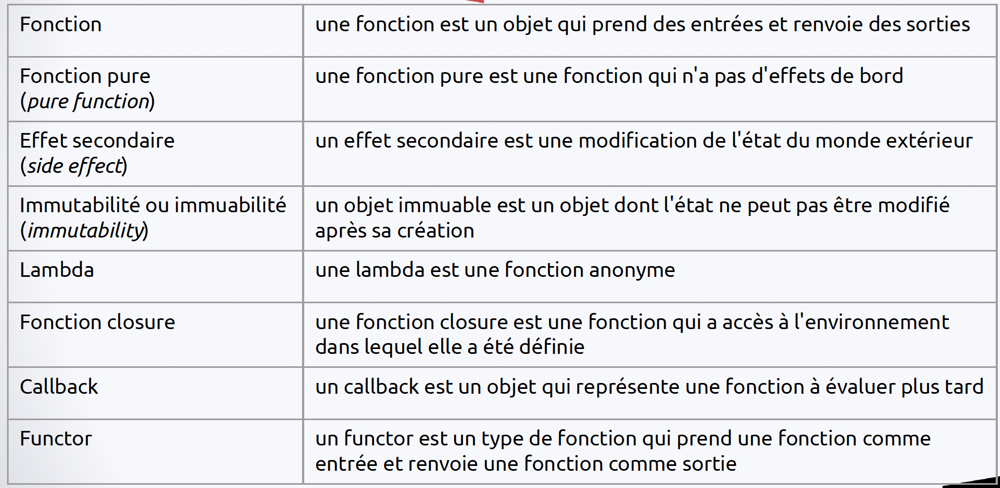
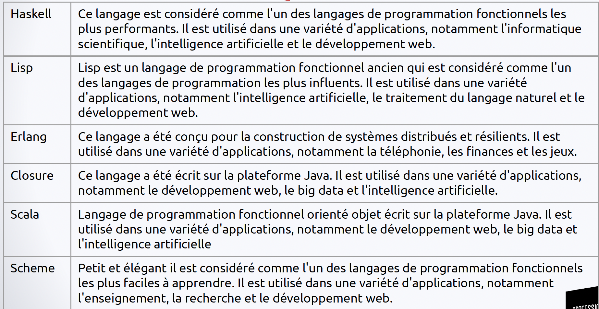

- La programmation fonctionnelle est un paradigme de programmation qui insiste sur l'évaluation d'appel de `fonctions` plutôt que sur l'utilisation de variables et de blocs imbriqués
- Les fonctions fonctionnelles sont pures, elles ne modifient pas l'état du monde extérieur rendant les programmes fonctionnels plus faciles à comprendre, à tester et à déboguer
- ----
- `Avantages`
	- - Programmes plus faciles à comprendre et à maintenir que les programmes impératifs
	- - Programmes moins susceptibles d'avoir des bugs
	- - Programmes plus faciles à paralléliser et à distribuer (cache)
- Différence programmation `fonctionnelle` et `impérative`
	- La programmation impérative traite les calculs comme une séquence d'instructions qui modifient l'état du monde extérieur
	- La programmation fonctionnelle traite les calculs comme des évaluations de fonctions qui ne modifient pas l'état du monde extérieur
- ----
- `Termes`
	- 
- `Principaux langages`
	- 
- ----
- ### Fonction pure
	- Ne modifie pas l'état du monde extérieur -> renverra toujours le même résultat avec les mêmes arguments
	- Pour qu'une fonction soit pure, elle doit respecter 3 conditions:
		- - `Sans effet secondaire` -> ne modifie pas une variable globale, d'instance ou locale
		- - `Déterministe` -> renverra toujours le même résultat avec les mêmes arguments
		- - `Transparence référentielle` -> peut être remplacée par son résultat sans changer le comportement du programme
	- Avantages:
		- - `Facilité de test` -> faciles à tester car comportement bien défini
		- - `Facilité de débogage` -> faciles à déboguer car n'ont pas d'effet secondaire
		- - `Parallélisation` -> faciles à paralléliser car ne dépendent pas de l'état du monde extérieur
		- - `Fiabilité` -> plus fiables car ne peuvent pas provoquer d'erreurs dues à des effets secondaires